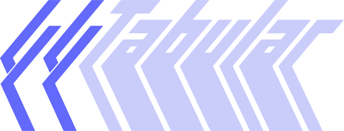

Provide [`go-cobra`](https://github.com/spf13/cobra)-style tab-completions for your
[Crystal](https://crystal-lang.org) CLI. While it is opinionated in it's adherence
to the [`go-cobra`](https://github.com/spf13/cobra) completions pattern, it does
not care how you get there.

> [!TIP]
> For detailed documentation, [click here](https://leshaunj.github.io/tabular).
