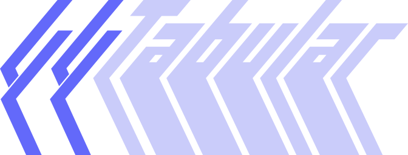

[][gh_pages]

[![Build Status][status_badge]][status_link]
[![Shard version][shard_badge]][shard_link]

Provide [tab-completions](https://en.wikipedia.org/wiki/Command-line_completion) for your
[Crystal](https://crystal-lang.org) CLI. While it is opinionated in it's adherence to the
[`go-cobra`](https://github.com/spf13/cobra) completions pattern, it does not care how you
get there.

> [!TIP]
> For detailed documentation, [click here][gh_pages].

[status_badge]: https://img.shields.io/github/actions/workflow/status/leshaunj/tabular/test.yml?style=for-the-badge&logo=github&label=Build
[status_link]: https://github.com/LeShaunJ/tabular/actions/workflows/test.yml
[shard_badge]: https://img.shields.io/github/v/release/leshaunj/tabular?style=for-the-badge&logo=crystal&label=Shard
[shard_link]: https://github.com/leshaunj/tabular/releases/latest
[gh_pages]: https://leshaunj.github.io/tabular
