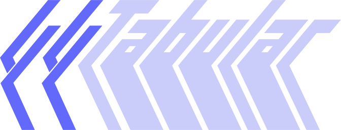

<style>
  .md-typeset h1 {
    display: none;
  }
</style>
<div>
  
</div>

Provide [`go-cobra`](https://github.com/spf13/cobra)-style tab-completions for your [Crystal](https://crystal-lang.org) CLI. While 
it is opinionated in it's adherence to the [`go-cobra`](https://github.com/spf13/cobra) completions 
pattern, it does not care how you get there.

## Installation

1. Add the dependency to your `shard.yml`:

   ```yaml
   dependencies:
     tabular:
       github: leshaunj/tabular
   ```

2. Install the dependency:

   ```bash
   shards install
   ```

## Why Tabular?

In keeping with the [Crystal](https://crystal-lang.org) theme, [`Tabular`][Tabular] concepts are based on the
[_tabular crystal habit_](https://en.wikipedia.org/wiki/Crystal_habit), a formation characteristic taken on by
minerals like [_Wulfenite_](https://en.wikipedia.org/wiki/Wulfenite#Gallery). That, plus <kbd>tab</kbd>
(completions); ah, you get it...
