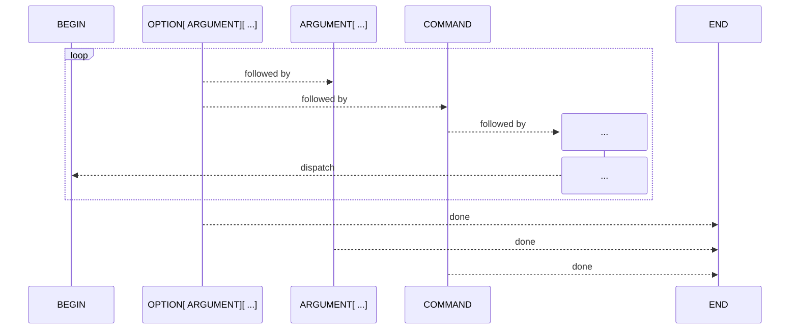

# Usage


## Basics

Ensure [`Tabular`][Tabular] is imported into your project:

```crystal
require "tabular"
```

[`Tabular.prompt?`][Tabular.prompt?] is convenience method that checks for the CLI
command (_`__complete` by default_) the shells will use to retrieve completions:

```crystal
if Tabular.prompt?
  # do stuff
end
```

Of course, you can always handle this however you'd like.

## Concepts

Beyond the [insanely _on-brand_](../#why-tabular) synergy of both platform and use-case, so to are the
concepts in [`Tabular`][Tabular]. Miraculously.

### Habit

A [`Habit`][Tabular::Habit] is the environment in which various features are made available for your
completion to take form. This done within the `block` of the [`Tabular.form`][Tabular.form] method:

```crystal
if Tabular.prompt?
  Tabular.form do
    # define your completions
  end
end
```

### Tablets

A [`Tablet`][Tabular::Tablet] represents any possible suggestion the end-user will receive, given the current 
argument. [`Tabular`][Tabular] comes with three _built-in_ [`Tablet`][Tabular::Tablet]:Tablet] styles:

```crystal
require "tabular"

if Tabular.prompt?
  Tabular.form do
    option "--opt" "-o", help: "a flag parameter"
  
    option "--arg" "-a", help: "a option with any argument" { argument }
    
    option "--file" "-f", help: "a option with file extension-specific argument" {
      argument "yaml", "yml", "json", directives: :filter_ext
    }

    option "--dir" "-d", help: "a option with directory-specific argument" {
      argument directives: :filter_dir
    }
  
    option "--opt2", help: "a flag with multiple arguments" do
      argument "arg1_choice1", "arg1_choice2", "arg1_choice3"
      argument "arg2_choice1", "arg2_choice2"
    end
  
    command "cmd1", "cmd1_alias1", "cmd1_alias2", help: "a subcommand"
  end
end
```

> [!TIP]
> You can also create you own bespoke [`Tablets`][Tabular::Tablets] with the base [`Tablet`][Tabular::Tablet] class.

### Dispatch

When a [`Command`][Tabular::Kind::Command]-flavoured [`Tablet`][Tabular::Tablet] is matched, control is handed back to
your CLI via the [`#dispatch`][Tabular::Habit#dispatch] `block` when defined:

```crystal
require "tabular"

if Tabular.prompt?
  Tabular.form do
    command "validate", "valid", help: "validate infrastructure"
    command "config", "conf", "c", help: "get/set configs"
  
    dispatch do |command|
      if command.name == "cmd1"
        Validate.complete
      end
      if command.name == "cmd2"
        Config.complete
      end
  end
end

class Validate
  # ...

  def complete(args = ARGV)
    Tabular.form do
      option "--verbose" "-v"
      option "--dry-run" "-n"

      argument "tf", directive: :filter_ext
    end
  end
end

class Config
  # ...

  def complete(args = ARGV)
    Tabular.form do
      argument "*/config/*", directive: :filter_dir
      argument "json", "ejson", directive: :filter_ext
    end
  end
end
```

Any unhandled [`Habit#command`][Tabular::Habit#command] [`Tablets`][Tabular::Tablets] will fallback to 
default completion behaviour for the given shell; but, you can override this behaviour:

```crystal
Tabular.form do
  # Globally override default command directives
  directives :command, :no_file

  # Override command deirectives
  command "action1", "act1", help: "A subcommand", directives: :no_file
end
```

### Flow



While, there is no mineral-based connection, it's important to understand the assumed flow of
the built-in [`Tablets`][Tabular::Tablet]:

* The flow begins with any [`Tablet`][Tabular::Tablet] flavour.
  ```sh
  cli {OPTIONS[ ARGUMENTS] ... | ARGUMENTS ... | COMMAND ...}
  ```
* A [`Option`][Tabular::Kind::Option] (and any required [`Argument`][Tabular::Kind::Argument]) 
  flavour can appear anywhere in the flow.
* A [`Command`][Tabular::Kind::Command] flavour can only follow an [`Argument`][Tabular::Kind::Argument]
  flavour when it a part of an [`Option`][Tabular::Kind::Option].
  ```sh
  cli [OPTIONS[ ARGUMENTS] ...] {ARGUMENTS ... | COMMAND ...}
  ```
* Once a [`Command`][Tabular::Kind::Command] flavour is matched:
  * The flow resets when [`#dispatch`][Tabular::Habit#dispatch] is defined.
  * Otherwise, the flow ends.
* Once a final [`Option`][Tabular::Kind::Option] or [`Argument`][Tabular::Kind::Argument]
  flavour is matched, the flow ends.

> [!TIP]
> You can leverage the [API](/Tabular) to create your own bespoke flow.

## Installer

Finally—to allow your users to setup completions in their shell—call [`Tabular.install!`][Tabular.install!]
when a subcommand of your choosing is provided to your CLI:

> [!TIP]
> It's recommended that you use the subcommand `completion`, as it follows the 
> [`go-cobra`](https://github.com/spf13/cobra) standard.

```crystal
require "tabular"

if Tabular.install?
  begin
    # Read arguments from `ARGV` or supply your own
    Tabular.install! # ["bash"]
  rescue e : Tabular::Error
    STDERR.puts e
    exit 1
  end
end
```
